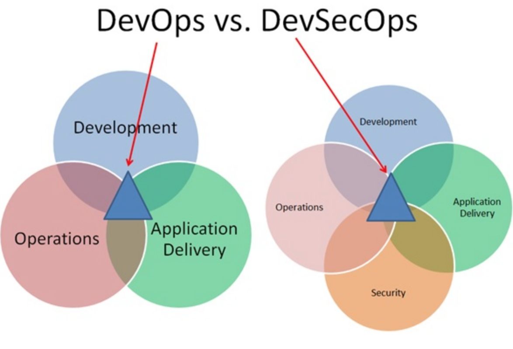
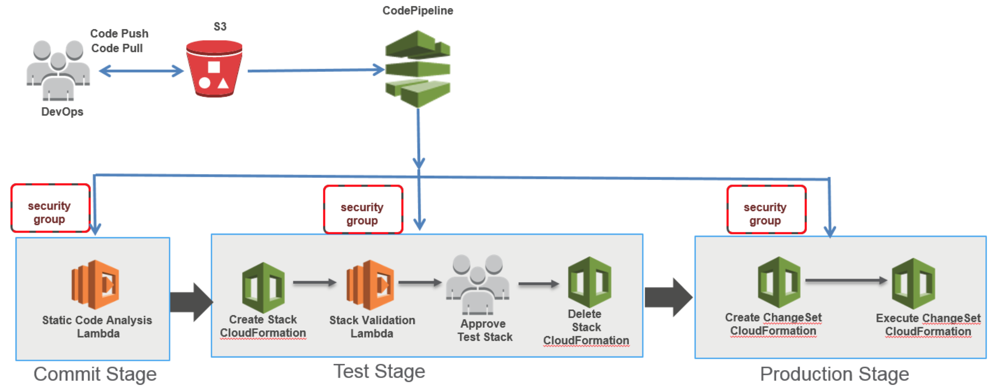
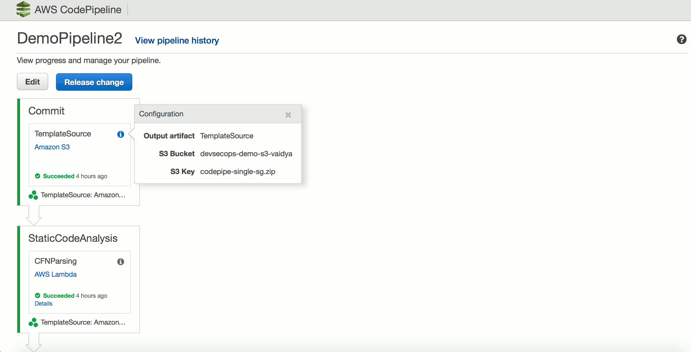

# DevSecOps

1.  [What is DevSecOps](#what-is-devsecops)
2.  [Components of DevSecOps](#components-of-devsecops)
3.  [Public Cloud IAM Best Practices](#public-cloud-iam-best-practices)
4.  [Static and Dynamic Analysis](#static-analysis-and-dynamic-analysis)
5.  [Secure DevOps Pipeline as Code](#secure-devops-pipeline-as-code)
    * [SEI's Microcosm](#seis-microcosm)
    * [Illustrative DevSecOps in AWS](#illustrative-devsecops-in-aws)

<h2>What is <i>DevSecOps?</h2></i>

<h6><a href="https://www.linkedin.com/pulse/what-devsecops-shannon-lietz?trkInfo=VSRPsearchId%3A946311454203481351%2CVSRPtargetId%3A6008272002333294592%2CVSRPcmpt%3Aprimary&trk=vsrp_influencer_content_res_name"><i>[Source Credit]</i></a></h6>

The purpose and intent of **_DevSecOps_** is to build on the mindset that **_"everyone is responsible for security"_** with the goal of safely distributing security decisions at speed and scale to those who hold the highest level of context without sacrificing the safety required. 

Traditional security operates from the position that once a system has been designed, its security defects can then be determined by security staff and corrected by business operators before the system is released.  It's hardly ever the case that a Security Team has all the information it needs to render a security decision that makes sense at the tale end of the value creation life cycle.  And as the value creation process speeds up to provide iterative value in order to closely map to customer demands, it is even more the case that a one-time tale end determination and testing of a complete system is actually destructive to the outcome.  In fact, most of the security decisions made this way are rarely effective, often overruled by business leaders, and commonly questioned when an incident or breach results.  

Traditional security is no longer an option in agile DevOps scenario.  It is far too late in the cycle and too slow to be cooperative in the design and release of a system built by iteration.  However, with the introduction of DevSecOps, it's not necessary for risk reduction to be abandoned by either the business operators or security staff; instead, it should be embraced and made better by everyone within the organization and supported by those with the skills to contribute security value into the system.  Without deliberate built-in security controls, systemic failures are certain because the mere avoidance of security puts more risk into the system.  Therefore, the idea that value creation and security cannot cooperate is absurd.

The mindset established by DevSecOps lends itself to a cooperative system whereby business operators are supplied with tools and processes that help with security decision making along with security staff that enable use and tuning for these tools.  In this case, security engineers more closely align with the DevSecOps manifesto, which speaks to the value that a security practitioner must supply as well as the changes they must make to enable security value to be supplied to a larger ecosystem.  In this way, the value that DevSecOps engineers supply to the system is an ability to continuously monitor, attack and determine defects before non-cooperative attackers might discover them.  And because of these changes DevSecOps engineers are hugely useful as competitors to external attackers.  This allows for all, including security staff, within the business ecosystem to contribute to iterative value creation without the additional pain of attempting to acquire severely scarce security practitioners to be added to DevOps teams.

Security needs to be added to all business processes and a dedicated team needs to be created to establish an understanding of the business, tooling to discover flaws, continuous testing, and science to forecast how to make decisions as a business operator.

[[Goto Top]](#devsecops)

## Components of DevSecOps
The core security epics of a DevSecOps pipeline include:

  * Identity and Access Management (IAM)
  * Logging and Monitoring
  * Infrastructure Security
  * Data Protection
  * Incident Response
  * Static Analysis
    - Infrastructure-as-Code
    - Security-as-Code
  * Dynamic Analysis
    - Unit Tests
    - Integration Tests
    - System Tests.
  
The following sections look at these at depth.

## Public Cloud IAM Best Practices
One of the most important component of DevSecOps is Identity and Access Management (IAM).  According to a Forbes survey, 73% of enterprises have adopted public cloud. However only 23% of organizations fully utilize public cloud, primarily because of InfoSec concerns. One of the chief anxiety is IAM. To tackle this, sharing <a href="Public%20Cloud%20IAM%20best%20practices.md"> here </a>a few best practices on IAM along with Logging and Monitoring of public cloud instances.

<a href="Public%20Cloud%20IAM%20best%20practices.md"></img></a>

[[Goto Top]](#devsecops)

## Static Analysis and Dynamic Analysis
Static analysis is performed in a non-runtime environment. Typically a static analysis tool will inspect program code for all possible run-time behaviors and seek out coding flaws, back doors, and potentially malicious code. Dynamic analysis adopts the opposite approach and is executed while a program is in operation. A dynamic test will monitor system memory, functional behavior, response time, and overall performance of the system. This method is not wholly dissimilar to the manner in which a malicious third party may interact with an application.

Static analysis, with its whitebox visibility, is certainly the more thorough approach and may also prove more cost-efficient with the ability to detect bugs at an early phase of the software development life cycle. For example, if an error is spotted at a review meeting or a desk-check – both types of static analysis – it can be relatively cheap to remedy. Had the error become lodged in the system, costs would multiply. Static analysis can also unearth future errors that would not emerge in a dynamic test. Dynamic analysis, on the other hand, is capable of exposing a subtle flaw or vulnerability too complicated for static analysis alone to reveal and can also be the more expedient method of testing. A dynamic test, however, will only find defects in the part of the code that is actually executed. The enterprise must weigh up these considerations with the complexities of their own situation in mind. Application type, time, and company resources are some of the primary concerns. The level of [technical debt](https://www.atlassian.com/agile/software-development/technical-debt) the enterprise is willing to take on may also be measured. A certain amount of technical debt may be taken on if the financial benefits of beating a competitor to the market place outweigh the potential savings of more rigorously tested code. While both static and dynamic tests have their shortcomings, it is not ideal that the enterprise should face a choice. While static analysis could be considered a superior method of testing, it does not necessarily follow that it should automatically be chosen over dynamic analysis in every situation where the choice emerges.

The [OWASP](https://www.owasp.org) organization maintains a very good list of both commercial as well as open source tools [here](https://www.owasp.org/index.php/Static_Code_Analysis#Tools).

For those of you who remember the Periodic Table from your Chemistry class, XebiaLabs has drawn up an innovative periodic table of DevOps tools:

</img>

[[Goto Top]](#devsecops)

## Secure DevOps Pipeline as Code
Development pipeline: “an automated manifestation of your process for getting software from version control into the hands of your users.”

Security has to be injected in each and every point of a development pipeline as below:

### SEI's Microcosm
Software Engineering Insitute (SEI) of Carnegie Mellon University has established a miniature secure pipeline with automation called "Microcosm", leveraging IaC (Infrastructure as Code) via Vagrant and Chef.  The Microcosm pipeline provides a wiki service for team collaboration, a code repository for version control, and a chat bot to integrate with ChatOps services. Incorporating threat modeling during requirements determination, hardening environments, conducting security-focused code reviews, and automating security testing through continuous-integration builds throughout the SDLC helps to create a security foundation in any DevOps pipeline.

Components of Microcosm suite include:
* [Jenkins](https://jenkins.io) continuous integration build server
* [GitLab](https://about.gitlab.com) repository manager server
* [Selenium](https://www.seleniumhq.org) browser automation testing server
* [OwaspZap](https://www.owasp.org/index.php/OWASP_Zed_Attack_Proxy_Project) Attack Proxy automated penetration testing server
* [Mediawiki](https://www.mediawiki.org/wiki/MediaWiki) wiki server along with [Bugzilla](https://www.bugzilla.org/about/) issue tracking and [Hubot](https://hubot.github.com) chat bot
* Staging server

The entire Microcosm suite is available in [GitHub](https://github.com/SLS-ALL/devops-microcosm).

[[Goto Top]](#devsecops)

### Illustrative DevSecOps in AWS
Let us use [AWS CodePipeline](https://aws.amazon.com/codepipeline/) to illustrate orchestrating DevSecOps steps into a continuous delivery pipepline:

</img>

These resources are being used in this example:
* An [AWS CloudFormation](https://aws.amazon.com/cloudformation/) template to create the demo pipeline.
* A [Lambda](https://aws.amazon.com/lambda/) function to perform the static code analysis of the CloudFormation template.
* A [Lambda](https://aws.amazon.com/lambda/) function to perform dynamic stack validation for the security groups in scope.
* An [S3 bucket](http://docs.aws.amazon.com/AmazonS3/latest/dev/Welcome.html) as the sample code repository.
* An [AWS CloudFormation](https://aws.amazon.com/cloudformation/) source template file to create the security groups.
* Two [VPC](https://aws.amazon.com/vpc/)s to deploy the test and production security groups. 

These are the high-level security checks enforced by the pipeline:
* During "Source" stage, static code analysis for any open security groups.  The pipeline will fail if there are any violations.
* During "Test" stage, dynamic analysis to ensure port 22 (SSH) is open only to the approved IP CIDR range.  The pipeline will fail if there are any violations.

Implementation steps and execution processes are available [here](https://aws.amazon.com/blogs/devops/implementing-devsecops-using-aws-codepipeline/).

Detailed output from a sample execution is as below:

</img>

[[Goto Top]](#devsecops)

## Feedback
Please share your inputs with [Vaidyanathan Sivasubramanian](mailto:vsivasubram3@csc.com).
